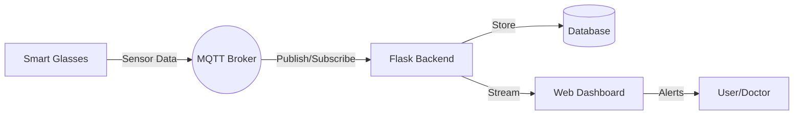

# Predict - Smart Health Monitoring System


> **Predict** It´s an advanced biometric monitoring ecosystem that integrates hardware, a real-time data analysis platform, and a pre-trained AI prediction model. 


---

## The Concept

This project stems from the need for non-invasive and constant clinical monitoring. The physical device, smart glasses, uses strategic anatomical points to obtain precise readings without causing discomfort to the user:


*   **Temporal Region :** contact thermal sensor for systemic temperature measurement.
*   **Earlobe:** Pulse oximeter for oxygen saturation and heart rate via photoplethysmography.


---

## Key Features

-    **Real-Time Monitoring:** Data transmission via MQTT with ultra-low latency.
-    **Intelligent Dashboard:** Dynamic visualization of vital signs.
-    **Alert System:** Automatic notifications when physiological levels move outside the normal range.
-    **Patient Management:** Centralized database for longitudinal tracking.
-    **Containerized:** Ready to deploy with Docker and Docker Compose.

---

##  Tech Stack

| Component | Technology |
| :--- | :--- |
| **Backend** | Python / Flask |
| **Database** | SQLAlchemy (SQLite/PostgreSQL) |
| **Communication** | MQTT Protocol (Mosquitto) |
| **Frontend** | HTML5 / CSS3 / Jinja2 |
| **Tasks** | APScheduler (Log cleanup) |

---

##  System Architecture



---

##  Installation & Usage

### Prerequisites
*   Python 3.9+
*   Docker & Docker Compose (optional)
*   MQTT Broker (e.g., Eclipse Mosquitto)

### Option 1: Docker (Recommended)
```bash
docker-compose up -d
```

### Option 2: Local
1. Install dependencies:
   ```bash
   pip install -r requirements.txt
   ```
2. Configure environment variables in `.env`:
   ```env
   MQTT_BROKER=localhost
   MQTT_PORT=1883
   SECRET_KEY=your_secret_key
   ```
3. Run the application:
   ```bash
   python app.py
   ```

---

##  Author

**Ricardo Gutierrez**
*   [GitHub](https://github.com/ricardorub)
*   [LinkedIn](https://linkedin.com/in/ricardo-gutierrez-9ba3b11b2/)

---

*Developed with feelings for health innovation.*
